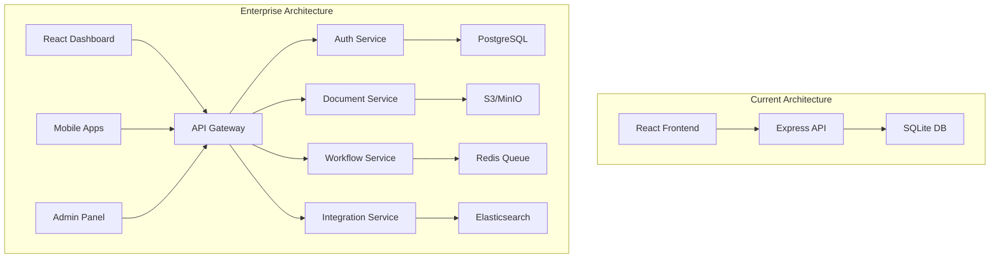

# Enterprise PDF Signing Platform - Professional Roadmap

## 🎯 Vision: DocuSign & Dropbox Sign Competitor

Transform the existing PDF signing application into a world-class, enterprise-grade platform that rivals industry leaders while offering superior value proposition.

## 🏆 Competitive Advantages Strategy

### **Current Strengths to Leverage**
- ✅ **Modern Tech Stack**: React 18, Vite, Node.js 18+ (more modern than DocuSign's legacy stack)
- ✅ **Clean Architecture**: Well-structured monorepo with clear separation of concerns
- ✅ **Security-First**: JWT, bcrypt, rate limiting already implemented
- ✅ **Developer-Friendly**: Hot reload, TypeScript support, comprehensive API
- ✅ **Cost Advantage**: Self-hosted option vs. expensive SaaS-only competitors

### **Key Differentiators to Build**
1. **Hybrid Deployment**: Cloud SaaS + On-premise enterprise options
2. **Developer-First**: Superior API experience with webhooks, SDKs
3. **AI-Enhanced**: Smart document processing and workflow optimization
4. **Cost-Effective**: Transparent pricing, no per-envelope charges
5. **Open Architecture**: Extensible platform with marketplace integrations

## 📋 Implementation Phases

### Phase 1: Professional Foundation (Weeks 1-4)
**Goal**: Transform current app into professional-grade platform

#### **Week 1: Advanced Authentication & Security**
- [ ] Multi-factor authentication (SMS, TOTP)
- [ ] SSO integration (SAML, OAuth2)
- [ ] Advanced password policies
- [ ] Session management improvements
- [ ] API key management system

#### **Week 2: Enterprise UI/UX**
- [ ] Professional design system implementation
- [ ] Advanced dashboard with analytics
- [ ] Bulk operations interface
- [ ] Advanced document management
- [ ] Responsive admin panel

#### **Week 3: Workflow Engine**
- [ ] Sequential and parallel signing workflows
- [ ] Conditional logic implementation
- [ ] Approval workflows
- [ ] Custom field types (dropdowns, radio, checkboxes)
- [ ] Template system enhancement

#### **Week 4: Core API Enhancement**
- [ ] REST API v2 with comprehensive endpoints
- [ ] Webhook system implementation
- [ ] Rate limiting and throttling
- [ ] API documentation (OpenAPI/Swagger)
- [ ] SDK generation (JavaScript, Python)

### Phase 2: Enterprise Features (Weeks 5-8)
**Goal**: Match enterprise feature set of competitors

#### **Week 5: Document Intelligence**
- [ ] PDF form field auto-detection
- [ ] OCR for scanned documents
- [ ] Document templates with smart fields
- [ ] Bulk document processing
- [ ] Advanced search and filtering

#### **Week 6: Compliance & Security**
- [ ] Digital signature standards (PKI, eIDAS)
- [ ] Audit trail enhancements
- [ ] GDPR compliance features
- [ ] SOC 2 Type II preparation
- [ ] Advanced encryption at rest

#### **Week 7: Integration Platform**
- [ ] Salesforce integration
- [ ] Google Workspace/Microsoft 365
- [ ] Zapier connector
- [ ] REST API marketplace
- [ ] Custom integration framework

#### **Week 8: Advanced Analytics**
- [ ] Real-time usage analytics
- [ ] Document completion tracking
- [ ] User behavior analytics
- [ ] Custom reporting engine
- [ ] Export capabilities

### Phase 3: Market Leadership (Weeks 9-12)
**Goal**: Exceed competitor capabilities

#### **Week 9: AI & Machine Learning**
- [ ] Smart signature field placement
- [ ] Document type recognition
- [ ] Fraud detection algorithms
- [ ] Completion time prediction
- [ ] Optimization recommendations

#### **Week 10: Mobile Excellence**
- [ ] Native mobile apps (React Native)
- [ ] Offline capability
- [ ] Biometric authentication
- [ ] Camera document scanning
- [ ] Mobile-optimized signing

#### **Week 11: Enterprise Administration**
- [ ] Multi-tenant architecture
- [ ] Advanced user management
- [ ] Role-based permissions
- [ ] Enterprise SSO
- [ ] White-label capabilities

#### **Week 12: Market Launch Preparation**
- [ ] Performance optimization
- [ ] Load testing (1000+ concurrent users)
- [ ] Security penetration testing
- [ ] Marketing website
- [ ] Customer onboarding flows

## 🛠️ Technical Architecture Evolution

### **Current → Enterprise Architecture**



### **Database Evolution: SQLite → PostgreSQL**
```sql
-- Multi-tenant schema design
CREATE SCHEMA tenant_001;
CREATE SCHEMA tenant_002;

-- Scalable document table
CREATE TABLE documents (
    id UUID PRIMARY KEY DEFAULT gen_random_uuid(),
    tenant_id UUID NOT NULL,
    user_id UUID NOT NULL,
    title TEXT NOT NULL,
    original_filename TEXT NOT NULL,
    file_size BIGINT NOT NULL,
    content_hash TEXT NOT NULL,
    status document_status_enum DEFAULT 'draft',
    workflow_id UUID,
    created_at TIMESTAMPTZ DEFAULT NOW(),
    updated_at TIMESTAMPTZ DEFAULT NOW(),
    metadata JSONB DEFAULT '{}'::jsonb
);

-- Horizontal scaling with partitioning
CREATE TABLE audit_logs (
    id UUID PRIMARY KEY DEFAULT gen_random_uuid(),
    tenant_id UUID NOT NULL,
    action TEXT NOT NULL,
    resource_type TEXT NOT NULL,
    resource_id UUID,
    user_id UUID,
    timestamp TIMESTAMPTZ DEFAULT NOW(),
    details JSONB
) PARTITION BY RANGE (timestamp);
```

## 💼 Business Model & Pricing Strategy

### **Competitive Pricing Analysis**
| Feature | DocuSign | Dropbox Sign | **Our Platform** |
|---------|----------|--------------|------------------|
| Basic Plan | $25/user/month | $20/user/month | **$15/user/month** |
| Per Document | $0.50 | $0.65 | **$0 (Unlimited)** |
| API Calls | $0.40/call | $0.50/call | **$0.10/call** |
| Enterprise | $60+/user/month | $45+/user/month | **$35/user/month** |

### **Revenue Streams**
1. **SaaS Subscriptions**: Tiered monthly/annual plans
2. **Enterprise Licenses**: On-premise deployment licenses
3. **API Usage**: Pay-per-call for high-volume integrations
4. **Professional Services**: Implementation, training, customization
5. **Marketplace**: Commission on third-party integrations

### **Go-to-Market Strategy**
1. **Developer Community**: Open-source community edition
2. **SMB Focus**: Better pricing for small/medium businesses
3. **API-First**: Target developers and technical buyers
4. **Compliance**: Focus on regulated industries (healthcare, finance)
5. **Self-Hosted**: Privacy-conscious organizations

## 🎯 Success Metrics & KPIs

### **Product Metrics**
- **User Adoption**: 10,000+ active users in 6 months
- **Document Volume**: 100,000+ documents processed monthly
- **API Usage**: 1M+ API calls monthly
- **Completion Rate**: >95% document completion rate
- **Performance**: <2s average page load time

### **Business Metrics**
- **Revenue**: $100K ARR in 12 months
- **Customer Acquisition**: <$50 CAC
- **Retention**: >90% annual retention rate
- **NPS Score**: >50 Net Promoter Score
- **Market Share**: 1% of SMB e-signature market

### **Technical Metrics**
- **Uptime**: 99.9% service availability
- **Security**: Zero security incidents
- **Performance**: 1000+ concurrent users supported
- **API Reliability**: 99.95% API success rate

## 🔄 Continuous Innovation Pipeline

### **Q1 2025: Foundation**
- Multi-tenant architecture
- Advanced authentication
- Professional UI/UX
- Core API development

### **Q2 2025: Growth**
- Mobile applications
- AI-powered features
- Enterprise integrations
- Advanced analytics

### **Q3 2025: Scale**
- International expansion
- Compliance certifications
- Partner ecosystem
- Advanced automation

### **Q4 2025: Leadership**
- AI/ML innovations
- Blockchain signatures
- IoT integrations
- Market expansion

## 🤝 Partnership Strategy

### **Technology Partners**
- **Cloud Providers**: AWS, Azure, GCP partnerships
- **Identity Providers**: Okta, Auth0, Ping Identity
- **Integration Platforms**: Zapier, Microsoft Power Platform
- **CRM Vendors**: Salesforce AppExchange, HubSpot Marketplace

### **Channel Partners**
- **System Integrators**: Consulting firms, implementation partners
- **Resellers**: Regional technology partners
- **Industry Partners**: Legal tech, HR tech, real estate tech

### **Strategic Alliances**
- **Complementary Products**: Document management, workflow automation
- **Vertical Solutions**: Industry-specific partnerships
- **International**: Regional partners for global expansion

---

## 🚀 Immediate Next Steps

1. **Choose Phase 1 Priority Features** (select 3-4 to implement first)
2. **Set Up Development Environment** for enterprise features
3. **Create Technical Specifications** for chosen features
4. **Begin Implementation** with iterative development approach
5. **Gather User Feedback** from early adopters

**Ready to begin? Let's start implementing the highest-impact features first!**
